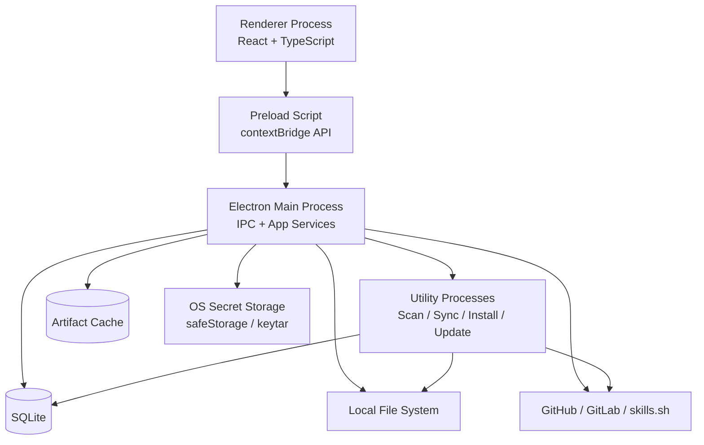
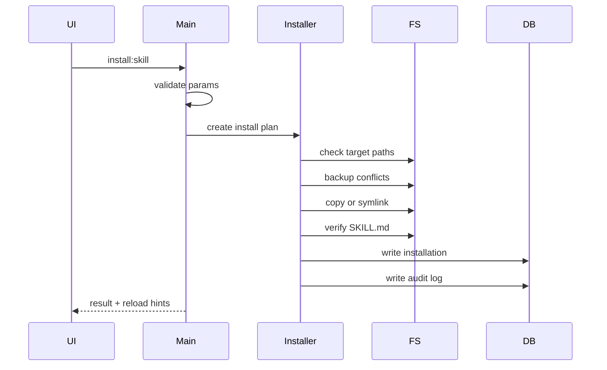

# 项目名称和Slogan
技能港 SkillPort

技能港 SkillPort
团队 AI Skills & Rules 的统一管理与分发工具
SkillPort
Manager for team AI Skills, Rules, and multi-platform distribution.

#详细开发规格
下面是把原规格优化为 **Electron 技术栈版本** 后的开发规格。产品能力保持不变：Skill 商店、一键分发、本地扫描、copy/symlink、平台目录覆写、GitHub/GitLab Token、版本管理、Rules 管理、离线运行、三语言支持。主要变化是：原来的 **Tauri + Rust 后端** 改为 **Electron 主进程 + Preload 安全桥 + Renderer 前端 + Utility Process 后台任务**。

---

# SkillPort / 技能港

## 团队 Skills & Rules 管理工具开发规格：Electron 版

> 暂用产品名：**技能港 SkillPort**
> 定位：团队 AI Skills、Rules、平台目录与分发策略的本地优先管理工具。

---

## 1. 技术栈总览

### 1.1 桌面端框架

使用 **Electron** 作为桌面应用框架。Electron 基于 Chromium 与 Node.js，可使用 JavaScript、HTML、CSS 构建跨平台桌面应用，并支持 macOS、Windows、Linux。([Electron][1])

推荐技术栈：

| 层级                | 技术选型                                                    |
| ----------------- | ------------------------------------------------------- |
| 桌面框架              | Electron                                                |
| 构建工具              | electron-vite / Vite                                    |
| 前端框架              | React + TypeScript                                      |
| UI 组件             | Radix UI / shadcn/ui / Ant Design 任选其一                  |
| 状态管理              | Zustand / Jotai                                         |
| 服务端状态             | TanStack Query                                          |
| 路由                | TanStack Router / React Router                          |
| 本地数据库             | SQLite                                                  |
| SQLite Node 绑定    | better-sqlite3 或 sqlite3                                |
| 配置文件              | YAML / JSON                                             |
| Markdown 解析       | gray-matter + unified / remark                          |
| SemVer            | semver                                                  |
| GitHub/GitLab API | fetch / undici / Octokit 可选                             |
| 文件扫描              | Node.js fs/promises + fast-glob                         |
| 后台任务              | Electron utilityProcess / Node Worker Threads           |
| Token 加密          | Electron safeStorage / keytar 可选                        |
| 打包分发              | electron-builder                                        |
| App 自更新           | electron-updater                                        |
| 国际化               | i18next                                                 |
| 日志                | electron-log                                            |
| 测试                | Vitest + Playwright + Spectron 替代方案：Playwright Electron |
| 代码质量              | ESLint + Prettier + TypeScript strict mode              |

---

## 2. 架构设计

### 2.1 Electron 进程模型

Electron 版采用四层结构：

1. **Renderer Process**
   负责 UI，不能直接访问 Node.js、文件系统、Token、SQLite。

2. **Preload Script**
   通过 `contextBridge` 暴露受控 API 给前端页面。

3. **Main Process**
   负责窗口、IPC、数据库、文件系统、Token、Source 同步、平台分发、审计日志。

4. **Utility Process / Worker**
   负责耗时任务，例如仓库同步、本地扫描、checksum 计算、批量安装、Rule diff 生成。Electron 的 `utilityProcess` 可以从主进程创建带 Node.js 能力的子进程，适合隔离耗时或容易崩溃的任务。([Electron][2])



Electron 中主进程与渲染进程通过 IPC 通信，IPC 是调用原生能力、系统能力和跨进程功能的关键机制。([Electron][3])

---

## 3. 目录结构

推荐仓库结构：

```text
skillport/
  package.json
  electron.vite.config.ts
  tsconfig.json

  src/
    main/
      index.ts
      windows/
        main-window.ts
      ipc/
        catalog.ipc.ts
        sources.ipc.ts
        install.ipc.ts
        scan.ipc.ts
        rules.ipc.ts
        platforms.ipc.ts
        updates.ipc.ts
        audit.ipc.ts
      services/
        catalog/
        sources/
          github-source.ts
          gitlab-source.ts
          skills-sh-source.ts
          local-source.ts
        install/
        scan/
        rules/
        updates/
        platforms/
        config/
        security/
        audit/
        storage/
      db/
        index.ts
        migrations/
      workers/
        scan-worker.ts
        sync-worker.ts
        install-worker.ts
        checksum-worker.ts
      shared/
        types.ts
        errors.ts
        constants.ts

    preload/
      index.ts
      api.ts

    renderer/
      main.tsx
      app/
      routes/
      components/
      features/
        dashboard/
        skill-store/
        installed-skills/
        local-scan/
        rule-center/
        projects/
        sources/
        platform-settings/
        jobs-audit/
        settings/
      i18n/
        zh-CN.json
        zh-TW.json
        en.json
      styles/

    shared/
      schema/
        skill.schema.ts
        rule-package.schema.ts
        ipc.schema.ts
      types/
      utils/

  adapters/
    platforms/
      claude-code.yaml
      cursor.yaml
      windsurf.yaml
      codex.yaml
      kiro.yaml
      kilo-code.yaml
      gemini-cli.yaml
      cline.yaml
      qoder.yaml
      qoderwork.yaml
      codebuddy.yaml
      trae.yaml
      trae-cn.yaml
      opencode.yaml
      generic.yaml

  docs/
    skill-spec.md
    rule-package-spec.md
    platform-adapters.md
    security.md
    electron-architecture.md

  build/
    icons/
```

---

## 4. Electron 安全基线

这是 Electron 版最重要的部分。因为 Electron 自带 Node.js 能力，所以必须严格隔离 UI 和本地能力。

### 4.1 BrowserWindow 安全配置

所有窗口默认使用：

```ts
new BrowserWindow({
  width: 1440,
  height: 900,
  minWidth: 1180,
  minHeight: 760,
  webPreferences: {
    preload: path.join(__dirname, '../preload/index.js'),
    nodeIntegration: false,
    contextIsolation: true,
    sandbox: true,
    webSecurity: true,
    allowRunningInsecureContent: false
  }
})
```

Electron 官方建议启用 Context Isolation；该能力会让 preload 与页面运行在不同上下文中，防止网页直接访问 Electron 内部能力或 preload 中的高权限 API。Electron 12 之后 Context Isolation 默认启用，官方也建议所有应用都使用它。([Electron][4])

Electron 官方安全文档还建议启用 renderer sandbox；沙箱会使用操作系统机制限制渲染进程权限，Electron 20 之后该建议也是默认行为之一。([Electron][5])

### 4.2 Preload API 白名单

Renderer 不允许直接使用：

```ts
window.require
window.process
ipcRenderer
fs
path
child_process
shell
```

Preload 只暴露有限 API：

```ts
contextBridge.exposeInMainWorld('skillport', {
  catalog: {
    search: (params) => ipcRenderer.invoke('catalog:search', params),
    getDetail: (id) => ipcRenderer.invoke('catalog:get-detail', id)
  },
  sources: {
    list: () => ipcRenderer.invoke('sources:list'),
    sync: (sourceId) => ipcRenderer.invoke('sources:sync', sourceId)
  },
  install: {
    installSkill: (params) => ipcRenderer.invoke('install:skill', params)
  },
  rules: {
    previewApply: (params) => ipcRenderer.invoke('rules:preview-apply', params),
    applyPackage: (params) => ipcRenderer.invoke('rules:apply-package', params)
  }
})
```

`contextBridge.exposeInMainWorld` 是 Electron 推荐用于把 preload 中的受控 API 暴露给页面的方式；暴露的数据和函数会被复制、冻结或代理到页面上下文中。([Electron][6])

### 4.3 IPC 约束

所有 IPC 必须遵循：

1. 每个 IPC channel 有明确命名空间，例如 `catalog:search`。
2. 所有入参使用 Zod 校验。
3. Renderer 只能调用业务 API，不能传任意文件路径执行写入。
4. IPC 返回统一 Result 类型。
5. 主进程不得把 token、绝对敏感路径、系统环境变量泄露给 Renderer。
6. 所有文件写入先生成 plan，再执行。
7. 所有危险操作必须写 audit log。

统一返回结构：

```ts
type ApiResult<T> =
  | { ok: true; data: T }
  | {
      ok: false
      error: {
        code: string
        message: string
        detail?: unknown
      }
    }
```

---

## 5. 本地数据与存储设计

### 5.1 应用数据目录

Electron 提供 `app.getPath('userData')` 获取应用配置目录。官方文档建议应用自己的数据应存放在 `userData` 的子目录中，避免和 Chromium 自己的 Cache、Local Storage 等目录冲突。([Electron][7])

推荐目录：

```text
<userData>/
  skillport/
    catalog.sqlite
    config.yaml
    artifacts/
      sha256/
    unpacked/
    backups/
      skills/
      rules/
    logs/
    temp/
    lock/
```

### 5.2 SQLite 表

Electron 版保留原数据模型：

```text
sources
catalog_items
artifacts
platforms
installations
rule_packages
rule_files
projects
jobs
audit_log
settings
```

建议新增 Electron 版专用表：

```sql
CREATE TABLE app_runtime (
  key TEXT PRIMARY KEY,
  value TEXT NOT NULL,
  updated_at TEXT NOT NULL
);

CREATE TABLE job_events (
  id TEXT PRIMARY KEY,
  job_id TEXT NOT NULL,
  level TEXT NOT NULL,
  message TEXT NOT NULL,
  payload_json TEXT,
  created_at TEXT NOT NULL
);
```

---

## 6. Token 与凭据管理

### 6.1 Token 存储策略

GitHub Token、GitLab Token 不写入 SQLite 明文。

推荐策略：

| 方案                     | 用途                                                      |
| ---------------------- | ------------------------------------------------------- |
| Electron `safeStorage` | MVP 可用，简单加密本地 token                                     |
| keytar                 | 更完整地接入系统 Keychain / Credential Manager / Secret Service |
| 企业环境                   | 后续支持外部凭据提供器，例如环境变量、1Password CLI、Vault                  |

Electron 的 `safeStorage` 提供本地字符串加解密能力，并使用各平台系统加密能力；macOS 使用 Keychain，Windows 使用 DPAPI，Linux 使用不同 secret store，且 Linux 无 secret store 时可能退化为较弱保护，因此 UI 需要显示凭据保护状态。([Electron][8])

### 6.2 Token 状态

UI 中展示：

```text
GitHub Token
  状态：正常 / 即将限流 / 已失效 / 未配置
  剩余额度：4632 / 5000
  重置时间：2 小时 17 分钟后

GitLab Token
  状态：正常 / 权限不足 / 已失效 / 未配置
  实例：https://gitlab.company.com
```

---

## 7. 核心业务模块

### 7.1 Source Service

支持源类型：

```ts
type SourceKind =
  | 'github'
  | 'gitlab'
  | 'self-hosted-gitlab'
  | 'skills-sh'
  | 'local-dir'
  | 'archive'
```

Source 配置：

```ts
interface SourceConfig {
  id: string
  kind: SourceKind
  name: string
  enabled: boolean
  url: string
  apiBase?: string
  branch?: string
  paths?: string[]
  authRef?: string
  refreshIntervalMinutes?: number
  trustLevel: 'official' | 'team' | 'community' | 'unknown'
  tags?: string[]
}
```

Source Service 负责：

1. 同步远程源。
2. 扫描 `SKILL.md`。
3. 扫描 `RULE_PACKAGE.md`。
4. 下载 artifact。
5. 计算 checksum。
6. 写入 catalog。
7. 记录同步日志。
8. 在离线模式下返回缓存。

---

### 7.2 Catalog Service

Catalog Service 统一管理 Skill 与 Rule Package。

```ts
interface CatalogItem {
  id: string
  type: 'skill' | 'rule_package'
  sourceId: string
  slug: string
  name: string
  description?: string
  version?: string
  tags: string[]
  trustLevel: string
  checksum: string
  sourcePath: string
  repoUrl?: string
  commitSha?: string
  metadata: Record<string, unknown>
}
```

功能：

1. 解析 Markdown frontmatter。
2. 规范化 metadata。
3. 建立标签索引。
4. 建立版本索引。
5. 识别无版本包。
6. 识别同名不同源冲突。
7. 为 UI 提供搜索、筛选、排序。

---

### 7.3 Platform Adapter Registry

平台适配器仍使用外置 YAML，避免把平台目录写死在代码中。

```yaml
key: claude-code
displayName: Claude Code
enabled: true
supportedOS:
  - macos
  - windows
  - linux

skills:
  user:
    defaultPath: "~/.claude/skills"
    canOverride: true
  project:
    defaultPath: "<project>/.claude/skills"
    canOverride: true

rules:
  - scope: project
    path: "<project>/CLAUDE.md"
    type: file
    mergeStrategies:
      - section_merge
      - append_block
  - scope: project
    path: "<project>/.claude/CLAUDE.md"
    type: file
    mergeStrategies:
      - section_merge

install:
  defaultMode: symlink
  allowSymlink: true
  fallbackMode: copy

scan:
  enabled: true
  patterns:
    - "**/SKILL.md"
```

内置平台：

```text
Claude Code
Cursor
Windsurf
Codex
Kiro
Kilo Code
Gemini CLI
Cline
Qoder
QoderWork
CodeBuddy
Trae
Trae CN
OpenCode
Generic
```

设计原则：**官方目录、团队目录、用户自定义目录全部进入 adapter 配置，不在业务逻辑里硬编码。**

---

### 7.4 Install Service

安装参数：

```ts
interface InstallSkillRequest {
  itemId: string
  platformKeys: string[]
  scope: 'user' | 'project' | 'system'
  projectRoot?: string
  mode: 'copy' | 'symlink'
  overwritePolicy: 'fail' | 'backup-and-replace' | 'skip'
}
```

安装流程：



Copy / Symlink 行为：

| 模式            | 行为                       |
| ------------- | ------------------------ |
| Copy          | 复制完整 Skill 目录到目标平台       |
| Symlink       | 目标平台目录指向应用缓存或原始目录        |
| Junction      | Windows fallback，用于目录链接  |
| Copy fallback | symlink/junction 失败时自动回退 |

Windows 下的实现顺序：

```text
directory symlink
→ junction
→ copy fallback
```

安装前必须创建 install plan：

```ts
interface InstallPlan {
  itemId: string
  artifactPath: string
  targets: Array<{
    platformKey: string
    targetPath: string
    mode: 'copy' | 'symlink' | 'junction'
    conflict?: ConflictInfo
    backupPath?: string
  }>
  warnings: string[]
}
```

---

### 7.5 Local Scan Service

本地扫描通过 Utility Process 执行，避免 UI 卡顿。

扫描对象：

```text
~/.claude/skills/**
~/.agents/skills/**
~/.gemini/skills/**
.cursor/skills/**
.clinerules/**
项目目录
用户自定义目录
```

扫描规则：

1. 使用 fast-glob 查找 `SKILL.md`。
2. 忽略 `.git`、`node_modules`、`dist`、`target`、`.venv`。
3. 每个 `SKILL.md` 的父目录作为 Skill 根目录。
4. 解析 frontmatter。
5. 计算目录 checksum。
6. 检测 scripts、可执行文件、隐藏 prompt、缺少 version。
7. 返回候选列表。
8. 用户选择后导入或分发。

扫描结果：

```ts
interface LocalSkillCandidate {
  id: string
  name: string
  version?: string
  description?: string
  tags: string[]
  path: string
  detectedPlatform?: string
  fileCount: number
  checksum: string
  risks: RiskFinding[]
  importable: boolean
}
```

---

### 7.6 Rule Manager

Rule 管理保持原规格，但执行逻辑改为 Node.js 文件服务。

支持集中管理：

```text
.cursor/rules
.claude/CLAUDE.md
CLAUDE.md
AGENTS.md
GEMINI.md
.clinerules
.cursorrules
.windsurfrules
.kiro/steering
CODEBUDDY.md
自定义规则路径
```

Rule 包规格：

```yaml
---
kind: team-rule-package
id: frontend-nextjs
name: Frontend Next.js Rules
version: "1.4.0"
metadata:
  tags:
    - frontend
    - nextjs
    - typescript
applies_to:
  platforms:
    - cursor
    - claude-code
    - codex
    - opencode
  scopes:
    - project
  globs:
    - "apps/web/**"
rules:
  - id: general
    title: General Engineering Rules
    source: rules/general.md
    targets:
      - platform: agents-md
        path: AGENTS.md
        mode: section_merge
        section: "Team Rules: Frontend General"
---
```

受管区块：

```md
<!-- SKILLPORT:BEGIN frontend-nextjs/general@1.4.0 -->
...
<!-- SKILLPORT:END frontend-nextjs/general -->
```

Rule 应用流程：

1. 读取 Rule 包。
2. 匹配项目路径、平台、glob。
3. 生成 diff。
4. 用户确认。
5. 备份目标文件。
6. 写入受管区块。
7. 写入 audit log。
8. 更新项目 lockfile。

---

## 8. UI 信息架构

Electron 版 UI 保持你前面原型图中的结构。

左侧导航：

```text
Dashboard
Skill Store
已安装 Skills
本地扫描
Rule Center
Projects
Sources
Platform Settings
Jobs & Audit
Settings
```

顶部栏：

```text
Logo / 产品名 / 版本
团队工作区选择
全局搜索
立即同步
语言切换：简 / 繁 / EN
主题切换
通知
用户头像
```

主要页面：

| 页面                | 关键能力                                |
| ----------------- | ----------------------------------- |
| Dashboard         | KPI、最近任务、平台分发概览、Token 状态、审计动态       |
| Skill Store       | 多源商店、筛选、预览、安装、版本、风险提示               |
| 已安装 Skills        | 按 Skill / 平台 / 项目查看安装状态，更新、卸载、回滚    |
| 本地扫描              | 扫描本地 `SKILL.md`，导入并分发               |
| Rule Center       | Rule 包、项目规则、diff、应用历史               |
| Projects          | 管理项目根目录、项目级 Skills / Rules          |
| Sources           | GitHub / GitLab / skills.sh / 本地源配置 |
| Platform Settings | 平台目录、Rule 目标、安装模式、扫描行为              |
| Jobs & Audit      | 后台任务、日志、审计、失败重试                     |
| Settings          | 语言、主题、离线模式、缓存、自动更新、安全设置             |

---

## 9. 后台任务系统

### 9.1 Job 类型

```ts
type JobType =
  | 'sync-source'
  | 'sync-all-sources'
  | 'scan-local-skills'
  | 'install-skill'
  | 'update-skill'
  | 'apply-rule-package'
  | 'check-updates'
  | 'cleanup-cache'
```

### 9.2 Job 状态

```ts
type JobStatus =
  | 'pending'
  | 'running'
  | 'success'
  | 'partial_success'
  | 'failed'
  | 'cancelled'
```

### 9.3 Job 执行原则

1. 耗时任务不在 Renderer 执行。
2. 主进程只调度任务。
3. Utility Process 负责执行。
4. Job 进度通过 IPC 推送给 UI。
5. 任务可取消。
6. 失败可重试。
7. 所有结果写入 `jobs` 和 `job_events`。

---

## 10. App 自更新与内容包更新

需要区分：

| 类型       | 说明              |
| -------- | --------------- |
| App 更新   | Electron 应用自身更新 |
| Skill 更新 | Skill 内容包版本更新   |
| Rule 更新  | Rule 包版本更新      |

### 10.1 App 自更新

Electron 内置 `autoUpdater` 支持 macOS 和 Windows；Electron 官方文档明确说明内置 autoUpdater 没有 Linux 内置支持，Linux 通常建议走发行版包管理器。([Electron][9])

本产品要求 macOS / Windows / Linux 都有一致体验，因此推荐使用 **electron-builder + electron-updater**。electron-builder 文档说明 `electron-updater` 支持 macOS DMG、Windows NSIS，以及 Linux AppImage、DEB、Pacman、RPM 等自动更新目标。([Electron Builder][10])

推荐 App 更新策略：

```yaml
appUpdate:
  provider: github | generic | s3
  channel: stable
  autoCheck: true
  autoDownload: false
  allowPrerelease: false
```

UI 行为：

1. 自动检查是否有 App 更新。
2. 发现更新后提示用户。
3. 用户确认后下载。
4. 下载完成后提示重启安装。
5. 企业环境允许关闭 App 自动更新。

### 10.2 Skill / Rule 内容更新

内容更新不依赖 Electron updater，由内部 Update Manager 实现：

```ts
interface ContentUpdatePolicy {
  autoCheck: boolean
  autoApplyTrustedSources: boolean
  allowMajorVersion: boolean
  blockScriptSkills: boolean
  schedule: 'manual' | 'startup' | 'daily' | 'weekly'
}
```

默认策略：

```yaml
contentUpdates:
  autoCheck: true
  autoApplyTrustedSources: false
  allowMajorVersion: false
  blockScriptSkills: true
```

---

## 11. 打包与发布

### 11.1 推荐打包目标

| 平台      | 推荐格式                 |
| ------- | -------------------- |
| macOS   | dmg + zip            |
| Windows | NSIS                 |
| Linux   | AppImage + deb + rpm |

electron-builder 可用于构建和打包 macOS、Windows、Linux 应用，并支持自动更新能力。([Electron Builder][11])

### 11.2 代码签名

要求：

| 平台      | 要求                             |
| ------- | ------------------------------ |
| macOS   | Developer ID 签名 + notarization |
| Windows | Authenticode 代码签名              |
| Linux   | AppImage / deb / rpm 按企业分发策略处理 |

electron-builder 文档说明 macOS 自动更新要求应用签名。([Electron Builder][10])

---

## 12. 离线运行

Electron 版离线策略：

| 功能                           | 离线可用 |
| ---------------------------- | ---- |
| 启动应用                         | 是    |
| 浏览已缓存 Skill 商店               | 是    |
| 浏览已缓存 Rule 包                 | 是    |
| 搜索本地 catalog                 | 是    |
| 本地扫描 `SKILL.md`              | 是    |
| copy / symlink 安装            | 是    |
| Rule diff 与应用                | 是    |
| 查看审计日志                       | 是    |
| 远程同步 GitHub/GitLab/skills.sh | 否    |
| 检查远程版本                       | 否    |
| App 自动更新                     | 否    |

离线状态来源：

```ts
interface NetworkStatus {
  online: boolean
  lastCheckedAt: string
  failedSources: string[]
}
```

UI 显示：

```text
在线状态：在线 / 离线 / 源不可达
最近成功同步：2026-06-23 10:32
当前使用缓存数据
```

---

## 13. 安全与供应链治理

### 13.1 Skill 风险检测

风险项：

| 风险                      | 等级  | 处理              |
| ----------------------- | --- | --------------- |
| 包含 scripts 目录           | 中   | 安装前提示           |
| 包含可执行文件                 | 高   | 默认禁止自动更新        |
| 缺少 version              | 中   | 不参与 SemVer 自动升级 |
| checksum 改变但 version 未变 | 高   | 阻止自动更新          |
| 同名不同源                   | 高   | 要求用户选择          |
| 来源未知                    | 中   | 降低信任等级          |
| 包含大量隐藏注释                | 中   | 展示风险提示          |
| 外链过多                    | 低/中 | 展示外链列表          |

### 13.2 Rule 风险检测

风险项：

| 风险                    | 处理              |
| --------------------- | --------------- |
| 覆盖用户手写内容              | 默认禁止，要求 diff 确认 |
| 多个 Rule 包写入同一 section | 冲突              |
| 受管区块被手动修改             | 冲突              |
| 目标文件编码异常              | 阻止写入            |
| 路径逃逸                  | 阻止写入            |

### 13.3 Electron 专属安全要求

1. 禁止远程加载 Renderer 页面。
2. 禁止 `nodeIntegration: true`。
3. 禁止 `contextIsolation: false`。
4. 禁止把 `ipcRenderer` 原样暴露给页面。
5. 禁止 Renderer 直接传 shell 命令给 Main 执行。
6. 禁止 Skill 脚本在本工具中执行。
7. 所有外部 URL 使用系统浏览器打开。
8. 所有下载内容写入临时目录后再校验。
9. 所有 archive 解包必须做 path traversal 防护。
10. 所有写入必须经过 backup + audit。

---

## 14. IPC API 设计

### 14.1 Catalog

```ts
window.skillport.catalog.search(params)

window.skillport.catalog.getDetail(itemId)

window.skillport.catalog.validate(itemId)
```

### 14.2 Sources

```ts
window.skillport.sources.list()

window.skillport.sources.upsert(source)

window.skillport.sources.delete(sourceId)

window.skillport.sources.sync(sourceId)

window.skillport.sources.syncAll()

window.skillport.sources.testConnection(sourceId)
```

### 14.3 Local Scan

```ts
window.skillport.scan.start({
  roots,
  platformKeys,
  ignore
})

window.skillport.scan.getResults(jobId)

window.skillport.scan.importCandidate({
  candidateId,
  mode
})
```

### 14.4 Install

```ts
window.skillport.install.createPlan({
  itemId,
  platformKeys,
  scope,
  projectRoot,
  mode
})

window.skillport.install.execute(planId)

window.skillport.install.uninstall(installationId)

window.skillport.install.rollback(installationId, backupId)

window.skillport.install.openTargetDir(installationId)
```

### 14.5 Rules

```ts
window.skillport.rules.scanProject(projectRoot)

window.skillport.rules.previewApply({
  packageId,
  projectRoot,
  platformKeys
})

window.skillport.rules.applyPackage({
  packageId,
  projectRoot,
  platformKeys,
  selectedRuleIds
})

window.skillport.rules.rollback(applicationId)
```

### 14.6 Platforms

```ts
window.skillport.platforms.list()

window.skillport.platforms.update(platformKey, config)

window.skillport.platforms.reset(platformKey)

window.skillport.platforms.validateTarget(platformKey)
```

### 14.7 Jobs & Audit

```ts
window.skillport.jobs.list(params)

window.skillport.jobs.cancel(jobId)

window.skillport.jobs.retry(jobId)

window.skillport.audit.list(params)
```

---

## 15. 配置文件规格

保留配置文件预置能力。

```yaml
app:
  language: zh-CN
  theme: system
  offlineMode: false
  autoStartLocalService: true

sources:
  - id: skills-sh
    name: skills.sh 官方源
    kind: skills-sh
    url: https://skills.sh
    enabled: true
    trustLevel: community

  - id: company-github-skills
    name: Company GitHub Skills
    kind: github
    url: https://github.com/acme/agent-skills
    branch: main
    paths:
      - skills
    authRef: github:default
    trustLevel: team

  - id: corp-gitlab-rules
    name: Corp GitLab Rules
    kind: self-hosted-gitlab
    url: https://gitlab.company.com/platform/ai-rules
    apiBase: https://gitlab.company.com/api/v4
    branch: main
    paths:
      - rule-packages
    authRef: gitlab:corp
    trustLevel: team

platforms:
  claude-code:
    enabled: true
    skillDir: "~/.claude/skills"
    projectSkillDir: "<project>/.claude/skills"
    installMode: symlink
    allowSymlink: true

  cursor:
    enabled: true
    skillDir: ".cursor/skills"
    ruleDir: ".cursor/rules"
    installMode: copy

scan:
  roots:
    - "~/.claude/skills"
    - "~/.agents/skills"
    - "~/.gemini/skills"
    - "~/work"
  ignore:
    - "**/node_modules/**"
    - "**/.git/**"
    - "**/target/**"
    - "**/dist/**"

updates:
  app:
    autoCheck: true
    autoDownload: false
  content:
    autoCheck: true
    autoApplyTrustedSources: false
    allowMajorVersion: false
```

---

## 16. Lockfile

项目级 lockfile 保持：

```text
.skillport.lock.yaml
```

示例：

```yaml
version: 1
generatedAt: "2026-06-23T12:00:00Z"

skills:
  - id: company-github-skills/pr-review
    name: pr-review
    version: "1.2.0"
    checksum: "sha256:..."
    installedTo:
      - platform: claude-code
        path: .claude/skills/pr-review
        mode: symlink
      - platform: codex
        path: .agents/skills/pr-review
        mode: copy

rules:
  - packageId: frontend-nextjs
    version: "1.4.0"
    checksum: "sha256:..."
    appliedTo:
      - path: AGENTS.md
        mode: section_merge
      - path: .cursor/rules/general.mdc
        mode: replace
```

---

## 17. CLI 设计

Electron 应用可以附带 Node CLI，复用主进程 services。

```bash
skillport sync
skillport sources list
skillport scan --root ~/work
skillport install pr-review --platform claude-code --mode symlink
skillport rules scan .
skillport rules apply frontend-nextjs --project .
skillport updates check
skillport doctor
```

CLI 结构：

```text
src/cli/
  index.ts
  commands/
    sync.ts
    scan.ts
    install.ts
    rules.ts
    doctor.ts
```

CLI 与桌面端共享：

```text
src/main/services
src/shared/schema
src/shared/types
```

---

## 18. 关键页面优化建议

### 18.1 Dashboard

新增 Electron 运行时状态：

```text
本地数据库：正常
后台任务进程：3 个运行中
缓存目录：可写
Token 加密：系统安全存储 / 降级保护
自动更新：已启用 / 企业禁用
```

### 18.2 Sources

新增：

```text
测试连接
测试 Token
查看 API 限流
查看最近同步日志
打开缓存目录
导入配置
导出配置
```

### 18.3 Platform Settings

新增：

```text
验证目录
打开目录
测试 symlink
测试 junction
恢复默认 adapter
导入 adapter YAML
```

### 18.4 Jobs & Audit

新增：

```text
任务实时日志
后台进程状态
失败重试
导出审计日志
清理历史任务
```

---

## 19. 开发里程碑

| 阶段  | 内容                                                 |
| --- | -------------------------------------------------- |
| M1  | Electron 基础框架、窗口、安全配置、preload API、i18n             |
| M2  | SQLite、配置系统、日志、app data 目录、Token 加密                |
| M3  | Source 管理：GitHub、GitLab、skills.sh、本地目录             |
| M4  | Catalog：Skill / Rule 包解析、搜索、标签、版本                  |
| M5  | Local Scan：utility process 扫描、风险检测、导入              |
| M6  | Platform Adapter：15+ 平台配置、目录覆写、健康检查                |
| M7  | Install：copy / symlink / junction / fallback、备份、回滚 |
| M8  | Rule Center：Rule 包、项目扫描、diff、应用、回滚                 |
| M9  | Update Manager：Skill / Rule 检查更新、自动策略、冲突处理         |
| M10 | App 打包：macOS / Windows / Linux、签名、自更新              |
| M11 | CLI、doctor、lockfile、企业配置导入导出                       |
| M12 | Beta：性能优化、安全审计、错误恢复、文档                             |

---

## 20. 验收标准：Electron 版

### 20.1 基础验收

| 编号  | 验收项                                  |
| --- | ------------------------------------ |
| E1  | macOS / Windows / Linux 可正常启动        |
| E2  | Renderer 无 Node.js 访问能力              |
| E3  | preload 只暴露白名单 API                   |
| E4  | 所有 IPC 参数有 schema 校验                 |
| E5  | SQLite 数据库位于 userData 子目录            |
| E6  | GitHub / GitLab Token 不以明文写入 SQLite  |
| E7  | 本地扫描不会阻塞 UI                          |
| E8  | 大规模同步任务不会阻塞 UI                       |
| E9  | copy / symlink / Windows fallback 可用 |
| E10 | 所有写入有备份与 audit log                   |

### 20.2 产品验收

| 编号  | 验收项                                               |
| --- | ------------------------------------------------- |
| P1  | 支持 GitHub / GitLab / 自托管 GitLab / skills.sh / 本地源 |
| P2  | 支持 Skill 商店筛选、预览、安装                               |
| P3  | 支持本地扫描已有 `SKILL.md`                               |
| P4  | 支持一键安装到 15+ 平台                                    |
| P5  | 支持每个平台目录覆写                                        |
| P6  | 支持 copy / symlink 双模式                             |
| P7  | 支持读取 `metadata.version` 并检查更新                     |
| P8  | 支持 Rules 集中管理与 diff 应用                            |
| P9  | 支持 Rule 包版本管理                                     |
| P10 | 支持离线浏览缓存和本地安装                                     |
| P11 | 支持简体中文、繁體中文、English                               |

### 20.3 发布验收

| 编号 | 验收项                                 |
| -- | ----------------------------------- |
| R1 | macOS dmg 构建成功                      |
| R2 | Windows NSIS 构建成功                   |
| R3 | Linux AppImage / deb / rpm 至少一种构建成功 |
| R4 | App 自更新策略验证通过                       |
| R5 | 自动更新可被企业配置关闭                        |
| R6 | crash log、app log、job log 可定位问题     |
| R7 | 安装包签名策略明确                           |

---

## 21. 最终建议

Electron 版建议采用这个实施原则：

> **Renderer 只做界面，Main Process 只做调度，Utility Process 做重活，所有本地能力通过受控 IPC 暴露。**

这样既能保留 Electron 的开发效率和跨平台生态，又能避免最常见的 Electron 安全问题。对于这个产品来说，Electron 版最大的优势是：前后端都可以用 TypeScript，开发团队上手快，GitHub/GitLab/文件系统/SQLite/打包生态成熟；最大的风险是安全边界要严格控制，尤其不能让 Renderer 直接接触 Node.js、文件系统、Token 或任意 IPC。
